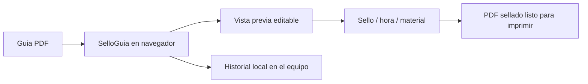

# SelloGuia

Herramienta web para sellar automaticamente guias de despacho en PDF antes de imprimirlas.

Este proyecto nace de una tarea operacional repetitiva: abrir documentos, ubicar el sello, ajustar la hora o datos visibles y preparar el archivo para impresion. SelloGuia convierte ese proceso manual en una experiencia directa desde el navegador.

## Estado del proyecto

- Herramienta funcional.
- Desplegada como aplicacion web privada.
- Pensada para uso operacional.
- Procesa PDFs localmente en el navegador.
- Mantenida como automatizacion practica para reducir trabajo manual.

## Problema

El flujo manual de sellar guias puede consumir tiempo cuando se repite muchas veces durante la operacion.

Los problemas principales eran:

- ubicar manualmente el sello en cada documento;
- repetir la misma posicion en PDFs similares;
- agregar hora o datos operativos antes de imprimir;
- evitar errores visuales antes de generar el documento final;
- reducir pasos entre recibir una guia y dejarla lista para impresion.

## Solucion

SelloGuia permite cargar un PDF, visualizar la guia, ubicar el sello sobre la pagina y generar una version final lista para imprimir.

El flujo esta pensado para que la persona pueda:

- cargar una guia de despacho en PDF;
- seleccionar o crear un timbre;
- mover el sello directamente sobre la guia;
- ajustar la inclinacion del timbre;
- activar o desactivar hora;
- usar doble sello si el flujo lo necesita;
- agregar material operativo por camion;
- revisar el resultado antes de descargar o imprimir;
- mantener historial local de PDFs sellados en el equipo.

## Impacto operacional

El valor de este proyecto esta en automatizar una tarea pequena, pero muy repetida.

Impactos esperados:

- menos pasos manuales antes de imprimir;
- menor probabilidad de olvidar sello u hora;
- posicionamiento mas consistente;
- flujo mas rapido para documentos similares;
- menos dependencia de edicion manual de PDFs.

## Privacidad

La app esta pensada para trabajar de forma local:

- los PDFs se procesan en el navegador;
- los documentos no se suben a un servidor del proyecto;
- el historial queda en el equipo del usuario;
- no se deben subir guias reales, timbres reales ni documentos privados al repositorio.

## Stack

- HTML
- CSS
- JavaScript
- PDF.js
- PDF-lib
- IndexedDB para historial local
- Vercel para despliegue

## Arquitectura general

## Seguridad del repositorio

El repositorio incluye reglas para evitar subir archivos sensibles, como PDFs reales, Excel, Word, ZIPs, llaves, certificados o variables `.env`.

Ver tambien:

- `SECURITY.md`

## Mi rol

Identifique una tarea operacional repetitiva, construi una herramienta especifica para resolverla y la fui ajustando segun necesidades reales: posicion del sello, inclinacion, hora, doble sello, historial y material operativo.

Este proyecto muestra una parte importante de mi forma de trabajar: no todas las soluciones tienen que ser grandes sistemas. A veces el impacto esta en automatizar bien una tarea pequena que se repite todos los dias.

