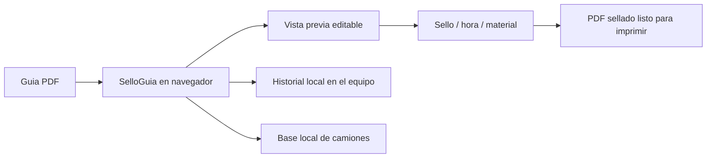

# SelloGuia

Herramienta local para sellar automaticamente guias de despacho en PDF antes de imprimirlas.

Este proyecto nace de una tarea operacional repetitiva: abrir documentos, ubicar el sello, ajustar la hora o datos visibles y preparar el archivo para impresion. SelloGuia convierte ese proceso manual en una experiencia directa desde el navegador.

## Estado del proyecto

- Herramienta funcional.
- Preparada para funcionar como aplicacion local/offline.
- Disponible como version portable para Windows.
- Pensada para uso operacional.
- Procesa PDFs localmente en el navegador.
- Mantenida como automatizacion practica para reducir trabajo manual.

## Problema

El flujo manual de sellar guias puede consumir tiempo cuando se repite muchas veces durante la operacion.

Los problemas principales eran:

- ubicar manualmente el sello en cada documento;
- repetir la misma posicion en PDFs similares;
- agregar hora o datos operativos antes de imprimir;
- evitar errores visuales antes de generar el documento final;
- reducir pasos entre recibir una guia y dejarla lista para impresion.

## Solucion

SelloGuia permite cargar un PDF, visualizar la guia, ubicar el sello sobre la pagina y generar una version final lista para imprimir.

El flujo esta pensado para que la persona pueda:

- cargar una guia de despacho en PDF;
- seleccionar o crear un timbre;
- mover el sello directamente sobre la guia;
- ajustar la inclinacion del timbre;
- activar o desactivar hora;
- usar doble sello si el flujo lo necesita;
- agregar material operativo por camion;
- sumar plasticos, envases y pallets detectados en la guia;
- revisar el resultado antes de descargar o imprimir;
- mantener historial local de PDFs sellados en el equipo.
- mantener una base local editable de camiones y capacidades.
- importar la base de camiones desde Excel o CSV.

## Impacto operacional

El valor de este proyecto esta en automatizar una tarea pequena, pero muy repetida.

Impactos esperados:

- menos pasos manuales antes de imprimir;
- menor probabilidad de olvidar sello u hora;
- posicionamiento mas consistente;
- flujo mas rapido para documentos similares;
- apoyo a conductores en la cuadratura diaria de envases;
- menor tiempo de cuadratura y aplicacion de timbres;
- menos dependencia de edicion manual de PDFs.

## Privacidad

La app esta pensada para trabajar de forma local:

- los PDFs se procesan en el navegador;
- los documentos no se suben a un servidor del proyecto;
- el historial queda en el equipo del usuario;
- la base de camiones queda en el equipo del usuario;
- la version de escritorio bloquea conexiones externas;
- la impresion abre un PDF temporal local en el visor del sistema;
- no se deben subir guias reales, timbres reales ni documentos privados al repositorio.

## Distribucion actual

La version portable de Windows se comparte actualmente mediante Google Drive:

```text
https://drive.google.com/file/d/1rSlcn3iynk1xbw0OYZn90tlmAMII2Dt8/view?usp=drivesdk
```

La idea es mantener este mismo enlace en el tiempo cuando sea posible. Para una nueva version, se reemplaza el archivo en Drive usando el mismo ID, en vez de crear un link nuevo. Asi se evita reenviar enlaces distintos y se mantiene un unico punto de descarga.

El archivo compartido es un `.zip` portable:

1. descargar el `.zip`;
2. descomprimirlo;
3. abrir `SelloGuia.exe`;
4. opcionalmente crear un acceso directo en el escritorio.

Drive solo se usa para descargar el archivo inicial. Una vez descargada, la aplicacion trabaja localmente.

## Stack

- HTML
- CSS
- JavaScript
- PDF.js
- PDF-lib
- SheetJS/XLSX para importar camiones desde Excel
- IndexedDB para historial local
- localStorage para base de camiones
- Electron para instalador de escritorio

## Uso local

Para desarrollo local:

```bash
pnpm dev
```

Para abrir la version de escritorio durante desarrollo:

```bash
pnpm desktop
```

Para generar instalador de Windows:

```bash
pnpm dist:win
```

Desde macOS Apple Silicon tambien se puede generar una carpeta Windows de prueba:

```bash
pnpm dist:win-folder
```

Para generar un ZIP portable liviano desde la carpeta Windows, se usa como base `dist/win-unpacked`. En la version compartida por Drive se conservaron los idiomas principales y se comprimio la carpeta resultante para mantener el archivo bajo el limite de subida.

La app de escritorio carga `index.html` desde disco y bloquea conexiones externas desde `electron/main.js`.

## Arquitectura general



## Seguridad del repositorio

El repositorio incluye reglas para evitar subir archivos sensibles, como PDFs reales, Excel, Word, ZIPs, llaves, certificados o variables `.env`.

Ver tambien:

- `SECURITY.md`

## Mi rol

Identifique una tarea operacional repetitiva, construi una herramienta especifica para resolverla y la fui ajustando segun necesidades reales: posicion del sello, inclinacion, hora, doble sello, historial y material operativo.

Este proyecto muestra una parte importante de mi forma de trabajar: no todas las soluciones tienen que ser grandes sistemas. A veces el impacto esta en automatizar bien una tarea pequena que se repite todos los dias.
